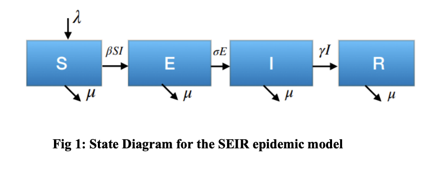

# COVID-19 peak estimation and effect of nationwide lockdown in India

## Authors
- Belfin R V (Corresponding author: researchbelfin@gmail.com)
- Piotr Bródka
- Radhakrishnan B L
- Rejula V

## Affiliations
1. Department of Computer Science and Engineering, Karunya Institute of Technology and Sciences, Coimbatore, India.
2. Department of Computational Intelligence, Wroclaw University of Science and Technology, Wrocław, Poland.

## Abstract
The study aims to predict the epidemic peak of COVID-19 in India using the SEIR compartmental model. The basic reproduction number (R0) is estimated to be 3.3, with the epidemic peak expected by September 2020. The study also discusses the effect of nationwide lockdown on delaying the epidemic peak.

## Introduction
COVID-19 originated in Wuhan, China, in December 2019 and rapidly spread worldwide. India's first case was reported on January 30, 2020. This study uses the SEIR model to predict the peak of the epidemic in India based on data from March 1 to April 14, 2020.

## Methods
### SEIR Model
Used to predict the epidemic peak.

### Polynomial Regression
Applied to estimate the infection rate (β).

### Parameters
- Infection rate (β): 0.33 (95% CI, 0.31-0.35)
- Basic reproduction number (R0): 3.3 (95% CI, 3.1-3.5)
- Onset rate (σ): 0.2
- Removal rate (γ): 0.1

## Results
The epidemic peak is estimated to be around September 2020 with approximately 450,000 cases. Lockdown measures significantly delay the epidemic peak, allowing the healthcare system to prepare and manage the situation better.

## Discussion
The study highlights the importance of interventions like lockdown to delay the epidemic peak. Continuous monitoring and extended interventions are recommended to control the spread of COVID-19.

## Acknowledgement
Supported by Polish National Science Centre and Wrocław University of Science and Technology statutory funds.

## Cite this

Belfin, R. V., Bródka, P., Radhakrishnan, B. L., & Rejula, V. (2022). COVID-19 peak estimation and effect of nationwide lockdown in India. Journal of Statistics and Management Systems, 25(6), 1361–1378. https://doi.org/10.1080/09720510.2021.1964741
